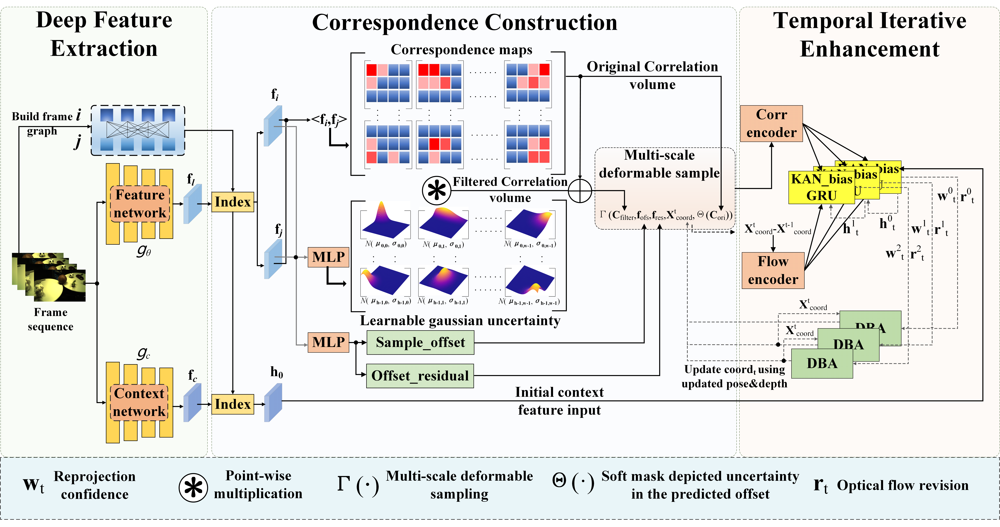

# LGU-SLAM


<center></center>


[LGU-SLAM: Learnable Gaussian Uncertainty Matching with Deformable Correlation Sampling for Deep Visual SLAM](https://arxiv.org/abs/2410.23231)  
Yucheng Huang, Luping Ji, Hudong Liu, Mao Ye

```
@misc{huang2024lguslamlearnablegaussianuncertainty,
      title={LGU-SLAM: Learnable Gaussian Uncertainty Matching with Deformable Correlation Sampling for Deep Visual SLAM}, 
      author={Yucheng Huang and Luping Ji and Hudong Liu and Mao Ye},
      year={2024},
      eprint={2410.23231},
      archivePrefix={arXiv},
      primaryClass={cs.CV},
      url={https://arxiv.org/abs/2410.23231}, 
}
```

**Initial Code Release:** This repo currently provides a single GPU implementation of our monocular, stereo, and RGB-D SLAM systems. It currently contains demos, training, and evaluation scripts. 


## Requirements

To run the code you will need ...
* **Inference:** ~14G(GPU MEM) when "--frontend_window" is 20. 

* **Training:** Training requires a GPU with at least 24G of memory. 

## Getting Started
1. Clone the repo (you also need to clone [lietorch](https://github.com/princeton-vl/lietorch.git) and [eigen](https://gitlab.com/libeigen/eigen) in thirdparty)
```Bash
git clone https://github.com/UESTC-nnLab/LGU-SLAM.git
```

2. Creating a new anaconda environment using the provided .yaml file. Use `environment_novis.yaml` to if you do not want to use the visualization
```Bash
conda env create -f environment.yaml
pip install evo --upgrade --no-binary evo
pip install gdown
```

3. Compile the lietorch CUDA extensions (takes about 6 minutes)
```Bash
python setup.py install
```

4. Compile the LGU(learnable gaussian uncertainty + deformable sampling + low-memory deformable sampling) CUDA extensions (takes about 8 minutes)
```Bash
cd offersample_LGS
python setup.py install
```


## Demos

2. Download some sample videos using the provided script.
```Bash
./tools/download_sample_data.sh
```

Run the demo on any of the samples (all demos can be run on a GPU with 12G of memory). While running, press the "s" key to increase the filtering threshold (= more points) and "a" to decrease the filtering threshold (= fewer points). To save the reconstruction with full resolution depth maps use the `--reconstruction_path` flag.


```Python
python demo.py --imagedir=data/abandonedfactory --calib=calib/tartan.txt --stride=2
```

```Python
python demo.py --imagedir=data/sfm_bench/rgb --calib=calib/eth.txt
```

```Python
python demo.py --imagedir=data/Barn --calib=calib/barn.txt --stride=1 --backend_nms=4
```

```Python
python demo.py --imagedir=data/mav0/cam0/data --calib=calib/euroc.txt --t0=150
```

```Python
python demo.py --imagedir=data/rgbd_dataset_freiburg3_cabinet/rgb --calib=calib/tum3.txt
```


**Running on your own data:** All you need is a calibration file. Calibration files are in the form 
```
fx fy cx cy [k1 k2 p1 p2 [ k3 [ k4 k5 k6 ]]]
```
with parameters in brackets optional.

## Evaluation

### TartanAir (Mono + Stereo)
Download the [TartanAir](https://theairlab.org/tartanair-dataset/) dataset using the script `thirdparty/tartanair_tools/download_training.py` and put them in `datasets/TartanAir`
```Bash
./tools/validate_tartanair.sh --plot_curve            # monocular eval
./tools/validate_tartanair.sh --plot_curve  --stereo  # stereo eval
```

### EuRoC (Mono + Stereo)
Download the [EuRoC](https://projects.asl.ethz.ch/datasets/doku.php?id=kmavvisualinertialdatasets) sequences (ASL format) and put them in `datasets/EuRoC`
```Bash
./tools/evaluate_euroc.sh                             # monocular eval
./tools/evaluate_euroc.sh --stereo                    # stereo eval
```

### TUM-RGBD (Mono)
Download the fr1 sequences from [TUM-RGBD](https://vision.in.tum.de/data/datasets/rgbd-dataset/download) and put them in `datasets/TUM-RGBD`
```Bash
./tools/evaluate_tum.sh                               # monocular eval
```

### ETH3D (RGB-D)
Download the [ETH3D](https://www.eth3d.net/slam_datasets) dataset
```Bash
./tools/evaluate_eth3d.sh                             # RGB-D eval
```

## Training

First download the TartanAir dataset. The download script can be found in `thirdparty/tartanair_tools/download_training.py`. You will only need the `rgb` and `depth` data.

```
python download_training.py --rgb --depth
```

**Note:** On the first training run, covisibility is computed between all pairs of frames. This can take several hours, but the results are cached so that future training runs will start immediately. 


```
python train.py --datapath=<path to tartanair>
```
## To 3DGS
Fine-tune the LGU/DROID reconstruction results using the combination of 'executeSlam.py' and 'pc2mesh.py' in 'to3DGS' directory and output the final mesh based scene reconstruction. Referring to project [Splat-SLAM](https://github.com/google-research/Splat-SLAM), [SplaTAM](https://github.com/spla-tam/SplaTAM) and [GO-SLAM](https://github.com/youmi-zym/GO-SLAM).

## Acknowledgements
Data from [TartanAir](https://theairlab.org/tartanair-dataset/) was used to train our model. We additionally use evaluation tools from [evo](https://github.com/MichaelGrupp/evo) and [tartanair_tools](https://github.com/castacks/tartanair_tools).


Thank you [DROID](https://github.com/princeton-vl/DROID-SLAM.git) and [Efficient-KAN](https://github.com/Blealtan/efficient-kan) for inspiring our work.
